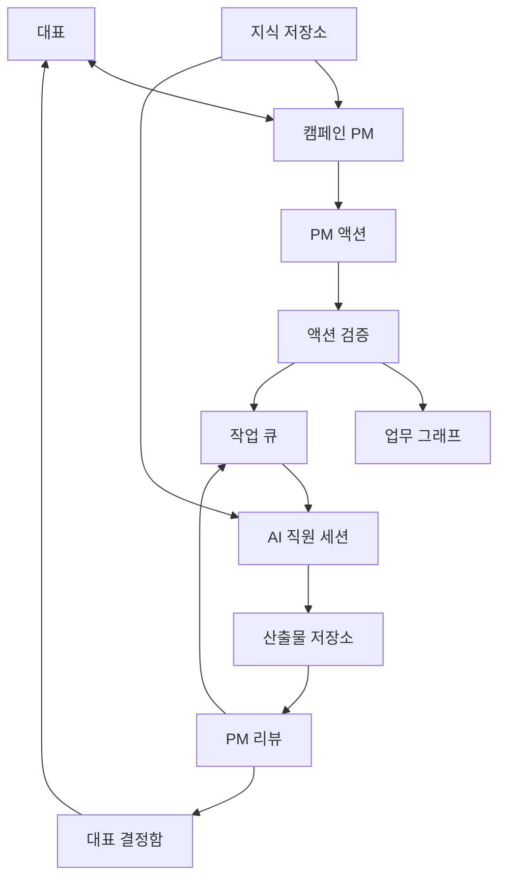

# 시스템 아키텍처

Last updated: 2026-05-29

## 1. 설계 방향

V2는 "대화형 PM 운영 시스템"으로 설계한다.

중심 구조:



## 2. 권장 기술 구조

V2는 파일만으로 모든 상태를 관리하기보다, 상태 인덱스는 SQLite, 산출물과 문서는 파일로 두는 하이브리드 구조를 추천한다.

| 영역 | 추천 |
| --- | --- |
| 웹앱 | Node.js + TypeScript + React 또는 Svelte |
| 서버 | Node.js + TypeScript |
| 상태 저장 | SQLite |
| 산출물 저장 | Markdown/HTML/JSON 파일 |
| 이벤트 로그 | SQLite table + JSONL export |
| AI 실행 | Codex CLI 세션 |
| PM/직원 모델 | 고성능 Codex 모델 |
| 서기/정리 모델 | 저비용 Codex 모델 |

SQLite를 추천하는 이유:

- 작업 큐, 상태 전이, 관계 조회가 JSON 파일보다 안전하다.
- 산출물은 파일로 남겨 사람이 직접 열람할 수 있다.
- 나중에 동기화나 백업을 붙이기 쉽다.

## 3. 런타임 구성

```text
Browser UI
  -> Local API Server
    -> SQLite State Store
    -> File Artifact Store
    -> Codex PM Runner
    -> Codex Worker Runner
    -> Codex Scribe Runner
```

## 4. 주요 모듈

| 모듈 | 책임 |
| --- | --- |
| Campaign Service | 캠페인 생성, 상태 갱신, 현재 화면 projection |
| Conversation Service | 대표-PM 대화 저장, 메시지 이벤트 관리 |
| PM Action Service | PM 답변에서 액션 후보 생성, 검증, 반영 |
| Graph Service | 목표, 태스크, 산출물, 직원, 결정사항 관계 관리 |
| Queue Service | 작업 큐 생성, 실행, 재시도, 중단 |
| Agent Runner | Codex PM/직원/서기 실행 |
| Artifact Service | 산출물 생성, 버전, 리뷰, 뷰어 |
| Decision Service | 대표 결정 요청, 선택지, 승인 기록 |
| Knowledge Service | PM 기억, 참고 자료, 대표 메모 관리 |

## 5. 모델 역할 분리

| 역할 | 권장 모델 | 설명 |
| --- | --- | --- |
| 캠페인 PM | 고성능 Codex | 전략 판단, 업무 설계, 리뷰, 대표 응대 |
| AI 직원 | 고성능 Codex | 실제 산출물 작성 |
| 서기 | 저비용 Codex | 액션 후보 추출, 요약, 문서 정리 |
| 서버 | 코드 | 검증, 저장, 상태 전이, 실행 큐 관리 |

서기는 PM 판단을 대체하지 않는다. 서기는 PM의 자연어 답변을 구조화하고 공식 상태에 반영하기 쉽게 만드는 보조자다.

## 6. 상태 저장 원칙

공식 상태:

- SQLite tables
- 산출물 manifest
- 산출물 버전 파일

사람이 읽는 문서:

- Markdown mirror
- 보고서
- PM 기억 문서

실행 추적:

- 이벤트 로그
- Codex prompt/final/raw output

## 7. 안전 규칙

- 대표 결정이 필요한 작업은 자동 실행하지 않는다.
- 산출물 수정은 덮어쓰지 않고 새 버전으로 저장한다.
- PM 액션은 서버 검증을 통과해야 공식 상태가 된다.
- 직원 세션이 준비되지 않은 작업은 큐에서 실행하지 않는다.
- 외부 사실 확인이 필요한 항목은 AI가 확정한 것으로 표시하지 않는다.
- 자동 실행 중 실패하면 실패 원인과 다음 행동을 대표에게 보여준다.

## 8. 외부 접속과 공유

초기 V2는 로컬 앱으로 시작한다.

공유 방식은 두 가지로 분리한다.

| 목적 | 방식 |
| --- | --- |
| 다른 사람이 자기 컴퓨터에서 사용 | GitHub 배포, 설치 매뉴얼, 개인 Codex 계정 연결 |
| 대표가 외부에서 이어서 사용 | 화면 공유 또는 별도 동기화/메신저 연동 |

Slack 또는 Firebase 메신저는 초기 필수 기능이 아니다. 먼저 로컬 PM 운영 구조가 안정된 뒤 붙인다.
